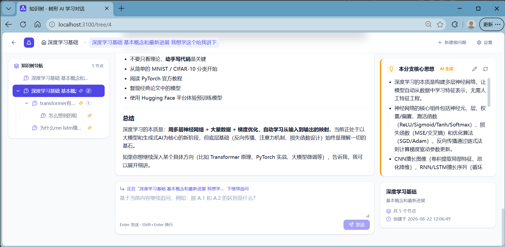

<p align="center">
  
</p>

<h1 align="center">🌳 知识树 · TreeMind AI</h1>

<p align="center">
  <b>把「直线型聊天」变成「树形学习」——每个追问都长成知识树的一个新分支。</b>
</p>

<p align="center">
  <a href="https://github.com/free1101/questiontree/stargazers"></a>
  <a href="https://github.com/free1101/questiontree/blob/main/LICENSE"></a>
  
  
  
  
  <a href="https://github.com/free1101/questiontree/issues"></a>
</p>

---

## 💡 为什么要用知识树？

和 AI 聊天学东西时，你是不是也这样：

- ❌ 聊天记录越长越乱，翻半天找不到「当时讲的那个点」
- ❌ 顺着一个话题越问越深，回头却忘了自己**学到了什么**、**学到哪了**
- ❌ 概念之间的关联只能靠脑补，没有一张能看清全貌的图

**知识树**把每一次「追问」变成树上的一个**节点**（问题 + AI 回答），AI 还会自动为每个分支提炼**核心思想摘要**，并沿祖先链逐层刷新。你的学习过程从一条线，变成一棵**越学越深、越学越清晰**的树。

## ✨ 功能特性

| 能力 | 说明 |
|---|---|
| 🧭 **树形追问** | 任意节点下继续追问，形成 `A → A.1 → A.1.1` 的知识树；也可新建根问题开启全新分支 |
| ✨ **自动分支摘要** | 回答完成后 AI 自动汇总整个子树的核心思想，并沿祖先链刷新上级摘要——树长多深都不迷路 |
| 🌲 **树形导航** | 左侧递归树（展开/折叠、当前高亮、悬停快捷追问）+ 顶部路径面包屑，点击任意节点回到对应上下文 |
| 📚 **多知识树** | 按主题管理多棵独立知识树（如「React 深入」「考研数学」……） |
| 📝 **Markdown 渲染** | 小标题、列表、代码块、表格、引用完整支持，流式打字体验 |
| ✏️ **摘要可编辑** | 手动编辑后的摘要不会被 AI 自动覆盖，你的思考优先 |
| 🔑 **双 Key 模式** | 服务端集中配置共用 Key（适合部署给多人用），也支持用户设置页自填 Key |

## 🖼️ 界面预览

<p align="center">
  
</p>
<p align="center">
  <i>工作台界面：左侧树形导航、中间问答流、右侧 AI 自动提炼的分支摘要，顶部为路径面包屑。</i>
</p>

## 🧱 技术栈

- **前端**：React 18 + TypeScript + Vite + Tailwind CSS
- **后端**：Node.js + Express（前后端一体单进程）
- **数据库**：SQLite（better-sqlite3，文件型零配置）
- **LLM**：火山方舟 Ark OpenAI 兼容端点，默认 `deepseek-v4-flash`（也支持豆包系列 / 任意 `ep-xxx` 接入点）

## 🚀 快速开始（5 分钟跑起来）

```bash
# 1. 克隆并安装
git clone https://github.com/free1101/questiontree.git
cd questiontree
npm install

# 2. 配置 Key
cp .env.example .env
# 编辑 .env，填入 ARK_API_KEY（获取方式见下方）

# 3. 开发模式（前端 5173 + 后端自动重启）
npm run dev
```

打开 **http://localhost:5173** 即可使用。

### 生产模式（单进程托管静态页 + API）

```bash
npm run build
npm start          # 默认端口 3000，.env 可改 PORT
```

### 获取火山方舟 API Key

1. 打开 [火山方舟控制台](https://console.volcengine.com/ark)
2. **API Key 管理 → 创建**，复制 Key
3. 填入 `.env` 的 `ARK_API_KEY`；或部署后让用户在应用「设置」页自填自己的 Key

### 环境变量

| 变量 | 说明 |
|---|---|
| `PORT` | 服务端口，默认 `3000` |
| `ARK_API_KEY` | 服务端共用 Key（可留空，用户可在设置页自填） |
| `ARK_BASE_URL` | 火山方舟端点：套餐通道 `/api/plan/v3` 或标准 Key 通道 `/api/v3` |
| `ARK_MODEL` | 默认模型 ID，如 `deepseek-v4-flash`、`doubao-*` 或 `ep-xxx` 接入点 |

## ☁️ 部署到服务器（多人使用）

所有用户共享服务器配置的 Key，**无需各自注册**，拿来即用：

```bash
git clone https://github.com/free1101/questiontree.git
cd questiontree
npm install
cp .env.example .env    # 填写 ARK_API_KEY / PORT
npm run build
npm start               # 或守护进程：pm2 start npm --name questiontree -- start
```

打开 `http://服务器IP:3000` 即可。数据保存在 `server/data/questiontree.db`（SQLite 文件，删除即清空）。

## 📁 目录结构

```
questiontree/
├── server/                # 后端（Express + SQLite + Ark LLM 封装）
│   ├── index.js           # 入口：路由 + 静态托管 + 错误处理
│   ├── db.js              # SQLite 数据层（树/节点 CRUD、嵌套组装）
│   ├── llm.js             # Ark 调用（流式问答 / 摘要 / 连接测试）
│   ├── summary.js         # 子树收集 + 摘要 prompt + 祖先链刷新
│   └── routes/            # trees / nodes / chat（SSE 流式）
└── src/                   # 前端（React）
    ├── pages/             # 首页 / 工作台 / 设置
    ├── components/        # 树导航、节点卡片、摘要卡片、面包屑、输入框
    └── lib/               # API 客户端（SSE 解析）、树工具函数
```

## ❓ 常见问题

**Q：没有火山方舟账号能用吗？**
A：本项目使用 OpenAI 兼容协议调用 Ark，改 `ARK_BASE_URL` + 模型即可对接任意兼容端点（OpenAI、DeepSeek 官方、本地 Ollama 等）。

**Q：数据会存到云端吗？**
A：不会。所有数据都在你自己的服务器/SQLite 文件里，隐私安全。

**Q：摘要为什么是英文/格式不对？**
A：摘要由 LLM 生成，结果随模型波动。可以手动编辑摘要（编辑后 AI 不再覆盖）。

## 🤝 贡献

欢迎任何形式的贡献——提 Issue、修 Bug、加功能、写文档：

1. Fork 本仓库并创建分支
2. 提交你的改动（`feat:` / `fix:` 前缀）
3. 发起 Pull Request

Star ⭐ 也是最大的支持！

## 📄 License

[MIT](./LICENSE) © 2026 Lena
